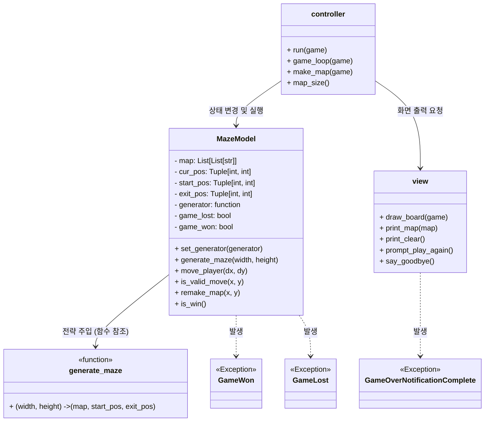

# 미로 게임 시스템 설계서 (System Design Document)
버전 : v1.0
작성일 : 2026-03-29
작성자 : 김신영

# 1. 아키텍처 개요 (Architecture Overview)
본 프로젝트는 **MVC (Model-View-Controller)** 아키텍처를 기반으로 설계되어 각 컴포넌트의 역할을 명확히 분리합니다. 
또한, 미로 생성 알고리즘의 유연한 교체와 확장을 위해 **전략 패턴(Strategy Pattern)**을 결합했습니다.

* **Model (데이터 및 비즈니스 로직):** 미로의 구조(그리드 배열), 플레이어의 좌표, 충돌 판정 및 승리 조건을 관리합니다.
* **View (프리젠테이션 로직):** 터미널/콘솔 환경에 미로 맵과 캐릭터의 현재 상태를 시각적으로 출력합니다.
* **Controller (제어 로직):** 사용자의 설정(크기, 알고리즘) 및 키보드 이동 입력을 받아 Model을 업데이트하고, 변경된 상태를 View에 전달하여 화면을 갱신합니다.

# 2. 클래스 다이어그램 (Class Diagram)

시스템을 구성하는 핵심 클래스들과 그 상호작용 관계를 나타냅니다.


# 3. 클래스 상세 명세 (Class Specifications)
## 3.1 Controller 계층
MazeController (함수 기반)

게임의 메인 루프(Main Loop)를 실행하는 오케스트레이터 역할을 합니다.

초기화 및 루프 관리: run() 함수와 game_loop() 함수를 통해 게임의 시작, 재시작, 종료 흐름을 제어합니다.

의존성 주입: 초기 설정 시 make_map() 함수에서 미로 생성 함수(generate_maze)를 MazeModel에 주입(Dependency Injection)합니다.
(현재는 함수를 주입 중이며, 향후 전략 패턴 클래스로 확장될 예정입니다.)

입력 처리: 사용자로부터 W, A, S, D 입력을 받아 좌표 변화량으로 변환하여 Model의 move_player를 호출합니다. Q 입력 시 게임을 종료합니다.

예외 처리 기반 상태 제어: GameLost, GameWon, GameOverNotificationComplete 등의 사용자 정의 예외를 캐치하여 게임 승패 상태를 제어합니다.

맵 크기 설정: map_size() 함수를 통해 사용자로부터 미로 크기(x, y)를 입력받으며, 최소 10 이상의 값을 강제합니다.

## 3.2 Model 계층
MazeModel

게임의 상태 데이터와 비즈니스 로직을 쥐고 있는 핵심 클래스입니다.

상태 데이터: map, start_pos, cur_pos (현재 플레이어 위치), exit_pos (종료 지점), game_lost, game_won 등의 상태를 관리합니다.

move_player(x, y): 입력받은 방향으로 이동을 시도하며, 내부적으로 is_valid_move를 호출하여 검증합니다. 이동이 유효하면 remake_map을 통해 맵 데이터를 갱신하고, 출구(exit_pos)에 도달했는지 확인합니다.

is_valid_move(x, y): 맵의 배열 범위를 벗어나는지, 또는 이동할 위치가 벽("#")인지 확인하여 True/False를 반환합니다.

remake_map(x, y): 이전 위치를 길(" ")로 지우고, 새로운 위치를 플레이어 기호("*")로 갱신합니다.

is_win(): 플레이어가 출구에 도달했을 때 호출되며, GameWon() 예외를 발생시켜 Controller로 승리 상태를 알립니다.

## 3.3 View 계층
MazeView

터미널 출력을 전담하며, Model의 데이터를 직접 수정하지 않고 화면에 렌더링하는 역할만 수행합니다.

draw_board(game) / print_map(map): Model로부터 전달받은 그리드 배열(game.map)을 순회하며 터미널에 미로를 출력합니다.

화면 초기화: print_clear() 함수를 통해 운영체제(Windows/Unix)에 맞는 화면 지우기(cls 또는 clear)를 수행하여 현재 상황만 출력합니다.

결과 출력 및 프롬프트: 승리 메시지, 작별 메시지(say_goodbye), 재시작 여부 입력(prompt_play_again) 등의 UI 텍스트를 처리합니다.

## 3.4 Strategy (알고리즘) 계층
MazeGenerator (인터페이스/추상 클래스)

현재는 외부 maze_model 모듈의 generate_maze 함수를 하드코딩으로 주입하여 미로를 생성하고 있습니다.

향후 인터페이스를 정의하고 RecursiveBacktracker 등의 구체화된 알고리즘 클래스들로 분리하여 동적으로 알고리즘을 교체될 예정입니다.

# 4. 데이터 구조 설계 (Data Structure)
미로의 맵 데이터는 메모리상에서 **2차원 문자열 배열**을 사용하여 관리합니다.

## 4.1 상태 값 정의
" " (공백) = 통로 (Path)

"#" = 벽 (Wall)

"*" = 플레이어 현재 위치 (Player)

"@" = 종료 지점 / 출구 (Exit)

## 4.2 그리드 크기 및 외곽선 규칙
입력 크기 제한: 사용자가 입력하는 x, y 값은 각각 최소 10 이상이어야 합니다.

객체 배치: generate_maze를 통해 맵 데이터가 생성된 후, MazeModel 내부에서 시작점 위치에 플레이어(*)를, 종료점 위치에 출구(@) 기호를 배열에 덮어씌워 초기 상태를 구성합니다.

## 4.3 데이터 배열 예시
미로가 메모리에 생성되었을 때의 2차원 문자열 배열 예시

```Python
map_data = [
    ["#", "#", "#", "#", "#", "#", "#"],
    ["#", "*", " ", " ", "#", " ", "#"],  # 시작점 위치에 플레이어('*') 배치
    ["#", "#", "#", " ", "#", " ", "#"],
    ["#", " ", " ", " ", " ", " ", "#"],
    ["#", " ", "#", "#", "#", "#", "#"],
    ["#", " ", " ", " ", " ", "@", "#"],  # 종료 위치에 출구('@') 배치
    ["#", "#", "#", "#", "#", "#", "#"]
]
```