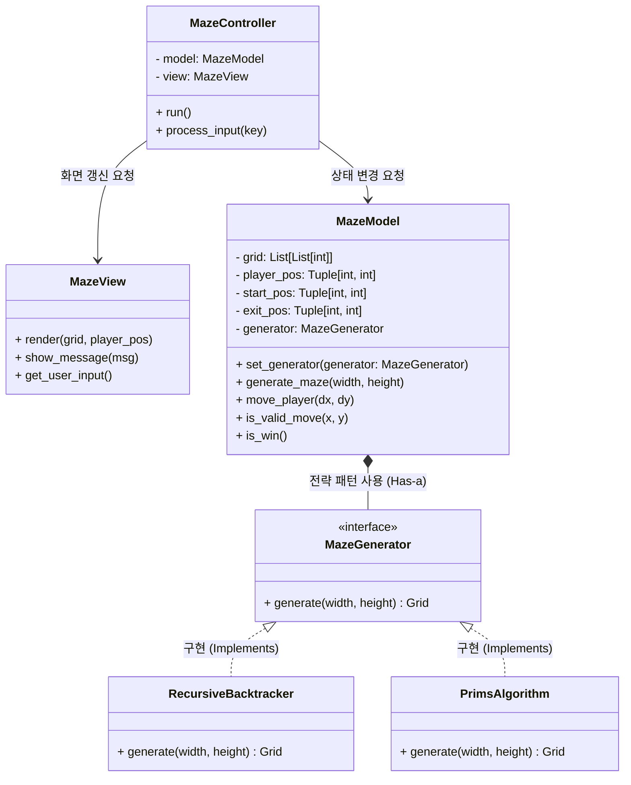

# 미로 게임 시스템 설계서 (System Design Document)
버전 : v1.0
작성일 : 2026-03-29
작성자 : 김신영

# 1. 아키텍처 개요 (Architecture Overview)
본 프로젝트는 **MVC (Model-View-Controller)** 아키텍처를 기반으로 설계되어 각 컴포넌트의 역할을 명확히 분리합니다. 
또한, 미로 생성 알고리즘의 유연한 교체와 확장을 위해 **전략 패턴(Strategy Pattern)**을 결합했습니다.

* **Model (데이터 및 비즈니스 로직):** 미로의 구조(그리드 배열), 플레이어의 좌표, 충돌 판정 및 승리 조건을 관리합니다.
* **View (프리젠테이션 로직):** 터미널/콘솔 환경에 미로 맵과 캐릭터의 현재 상태를 시각적으로 출력합니다.
* **Controller (제어 로직):** 사용자의 설정(크기, 알고리즘) 및 키보드 이동 입력을 받아 Model을 업데이트하고, 변경된 상태를 View에 전달하여 화면을 갱신합니다.

# 2. 클래스 다이어그램 (Class Diagram)

시스템을 구성하는 핵심 클래스들과 그 상호작용 관계를 나타냅니다.

# 3. 클래스 상세 명세 (Class Specifications)
## 3.1 Controller 계층
MazeController

게임의 메인 루프(Main Loop)를 실행하는 오케스트레이터 역할을 합니다.

초기 설정 시 사용자가 선택한 알고리즘 객체를 생성하여 MazeModel에 주입(Dependency Injection)합니다.

W, A, S, D 입력을 좌표 변화량(dx, dy)으로 변환하여 Model에 이동을 요청합니다.

## 3.2 Model 계층
MazeModel

게임의 상태 데이터를 쥐고 있는 핵심 클래스입니다.

move_player(dx, dy): 입력받은 방향으로 이동을 시도하며, 내부적으로 is_valid_move를 호출하여 벽(1)인지 또는 배열 범위를 벗어나는지 확인합니다.

is_win(): 현재 플레이어의 좌표(player_pos)가 종료 지점(exit_pos)과 일치하는지 검사하여 True/False를 반환합니다.

## 3.3 View 계층
MazeView

터미널 출력을 전담하며, Model의 데이터를 직접 수정하지 않고 읽기만 합니다.

render(): Model로부터 전달받은 그리드 배열과 플레이어 좌표를 조합하여 화면에 출력합니다. (예: 0은 공백, 1은 '벽', 플레이어는 'P' 등)

## 3.4 Strategy (알고리즘) 계층
MazeGenerator (인터페이스/추상 클래스)

모든 미로 생성 알고리즘이 반드시 구현해야 하는 generate(width, height) 메서드의 규격을 정의합니다.

RecursiveBacktracker, PrimsAlgorithm 등

Jamis Buck의 문서를 바탕으로 실제 미로 배열(Grid)을 생성해 내는 구체적인 구현체들입니다.

# 4. 데이터 구조 설계 (Data Structure)
미로의 맵 데이터는 메모리상에서 **2차원 정수 배열(List of Lists)**을 사용하여 관리합니다.

## 4.1 상태 값 정의
0 = 통로 (Path)

1 = 벽 (Wall)

## 4.2 그리드 크기 및 외곽선 규칙 (중요)
내부 크기: 사용자가 입력하는 가로(W), 세로(H)는 순수 내부 미로의 크기를 의미합니다.

실제 배열 크기: 외곽 벽을 처리하기 위해 실제 메모리에 생성되는 배열의 크기는 **(W + 2) x (H + 2)**가 됩니다.

외곽선(Boundary) 처리: 배열의 가장자리(인덱스 0 및 마지막 인덱스)는 기본적으로 모두 1(벽)로 채워 플레이어의 이탈을 방지합니다.

출입구(Start/Exit): 시작점과 종료점에 해당하는 외곽선 위치만 예외적으로 0(길)으로 뚫어 외부와 연결되도록 처리합니다.

## 4.3 데이터 배열 예시
사용자가 5x5를 입력했을 때, 실제 메모리에 생성되는 7x7 그리드의 예:
### 실제 메모리 크기: 7x7 (내부 5x5 + 상하좌우 외곽 벽)
grid = [
    [1, 0, 1, 1, 1, 1, 1], # y=0 (상단 외곽 벽): (1,0) 위치가 뚫린 시작점(입구)
    [1, 0, 0, 0, 1, 0, 1], # y=1 (내부 미로 시작)
    [1, 1, 1, 0, 1, 0, 1], # y=2
    [1, 0, 0, 0, 0, 0, 1], # y=3
    [1, 0, 1, 1, 1, 1, 1], # y=4
    [1, 0, 0, 0, 0, 0, 1], # y=5 (내부 미로 끝)
    [1, 1, 1, 1, 1, 0, 1]  # y=6 (하단 외곽 벽): (5,6) 위치가 뚫린 종료점(출구)
]